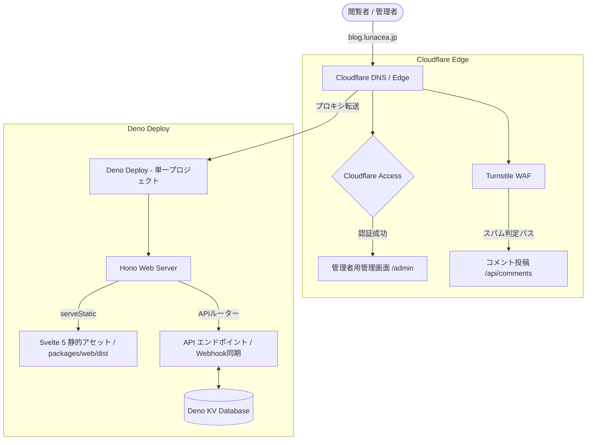

# blog.lunacea.jp


<br>


本プロジェクトは、 Deno 2.x および Svelte 5 を基盤とし、<br> Hono サーバーサイド配信と Deno KV
データベースを<br> 単一の Deno Deploy エッジクラウド環境で完結させた<br>
個人用のブログシステムです。

## 1. セットアップ手順

VS Code の **Devcontainer** の利用を標準開発環境（推奨）としています。<br>
コンテナに入ることで自動的にすべての環境が整います。

### 開発環境の起動手順

1. **コンテナでプロジェクトを開く**:
   - プロジェクトフォルダを VS Code で開き、<br> コマンドパレットから
     `Dev Containers: Reopen in Container` を選択します。
   - `devcontainer.json` の `postCreateCommand` に定義されたタスクによって<br> Deno
     のパッケージ解決と Git Hooks の設定が自動で実行されます。
2. **アプリケーションの同時起動**:
   - 以下のタスクを実行することで、API サーバーとフロントエンドが連動して起動します。
   ```bash
   # Hono API (Port 8000) & Vite Frontend (Port 5173) の同時起動
   deno task dev
   ```
3. **プレビューの確認**:
   - **Frontend**: [http://localhost:5173](http://localhost:5173)
   - **Backend Health Check**: [http://localhost:8000/api/health](http://localhost:8000/api/health)
   - Svelte 側の通信は自動的に Vite Proxy を経由して<br> Hono API サーバー（Port
     8000）にバイパスされるため、<br> 開発モードでも CORS 制限を受けずに動的な開発が可能です。

### コマンド一覧

ルートの deno.json に定義されている統合タスクの一覧です。

```bash
# アプリケーション全体の起動（API + フロントエンド）
deno task dev

# 各個別モジュールの開発・テスト
deno task dev:api       # APIサーバー単体起動
deno task dev:web       # フロントエンド単体起動
deno task test:cms      # CMSパーサーのテスト実行
deno task test:unit     # フロントエンドのユニットテスト実行（Vitest）
deno task test:e2e      # フロントエンドのE2Eテスト実行（Playwright）

# コード品質管理
deno task lint          # 静的解析チェック
deno task fmt           # コード自動整形
```

## 2. ディレクトリ構成

Deno 2.x workspaces を利用したマルチパッケージモノレポ構成を採用しています。

```txt
.
├── .devcontainer/         # 開発コンテナ構成定義
│   ├── devcontainer.json  # ポートフォワード・拡張機能・自動初期化タスク
│   └── Dockerfile         # Deno 2.x, fishシェル, Playwrightのキャッシュ
├── .github/
│   └── workflows/
│       └── ci.yml         # CI/CD パイプライン
├── .githooks/
│   └── pre-commit         # プレコミットフック
├── .vscode/
│   └── settings.json      # LSP, Linter, Auto-Formatter, シェル定義
├── packages/
│   ├── api/               # Hono Webサーバー / API [Deno 2.x]
│   ├── cms/               # MDX解析 / Markdownパーサー / テスト [Deno 2.x]
│   ├── components/        # 記事内で動作するSvelte UI
│   └── web/               # Svelte 5 フロントエンドアプリ / テスト / UIカタログ
├── shared/
│   └── types.ts           # フロント・バックエンド共有の型定義
├── deno.json              # モノレポ・ワークスペース設定および統合タスク定義
└── README.md              # 本ドキュメント
```

## 4. インフラ・デプロイ構成詳細

Deno Deploy の **Next-genデプロイメント・アーキテクチャ** を採用しています。

### システムネットワークトポロジー


